# 个人计算机现场：1985

说明：从商店货架到家庭书桌，从磁盘盒到电话线，从文字处理到专家系统，1985 年的软件世界正在迅速展开。《Whole Earth Software Catalog 2.0》记录的正是这个现场：人们开始用软件购物、写作、计算、组织信息、学习和连接他人。这本小册子用章节插画带读者穿过这本目录，重新看见早期个人计算机文化的日常面貌。

## 目录

1. How to Use This Book / pp.2-3
2. Shopping / pp.4-9
3. Computer Magazines / pp.10-13
4. Hardware / pp.14-21
5. Buying / pp.22-27
6. Playing / pp.28-45
7. Writing / pp.46-63
8. Analyzing / pp.64-77
9. Organizing / pp.78-93
10. Accounting / pp.94-105
11. Managing / pp.106-121
12. Drawing / pp.122-137
13. Telecommunicating / pp.138-157
14. Programming / pp.158-174
15. Learning / pp.175-191
16. Etc. / pp.192-199
17. Indexes / Update / pp.200-224

## 01. How to Use This Book

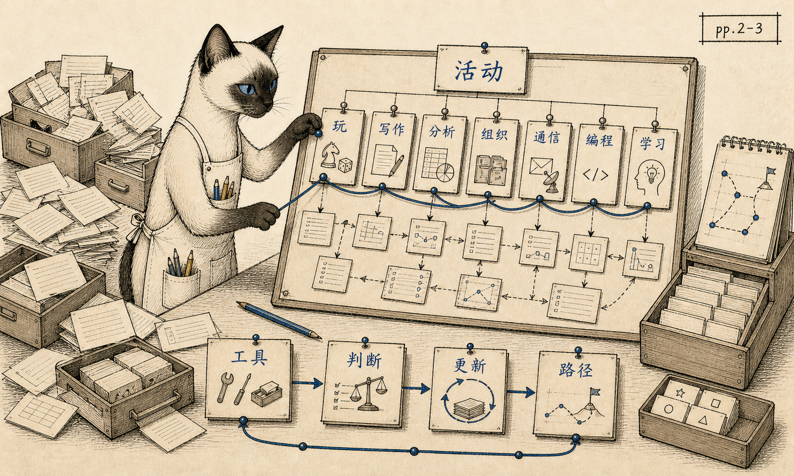

- range: pp.2-3
- anchor: 这本书不是软件清单，而是一套按人的活动来判断工具的方法。
- reader: 开篇已经说明本书的读法：不要从厂商、平台或功能列表出发，而要先看人的活动，再看软件如何成为工具。

## 02. Shopping

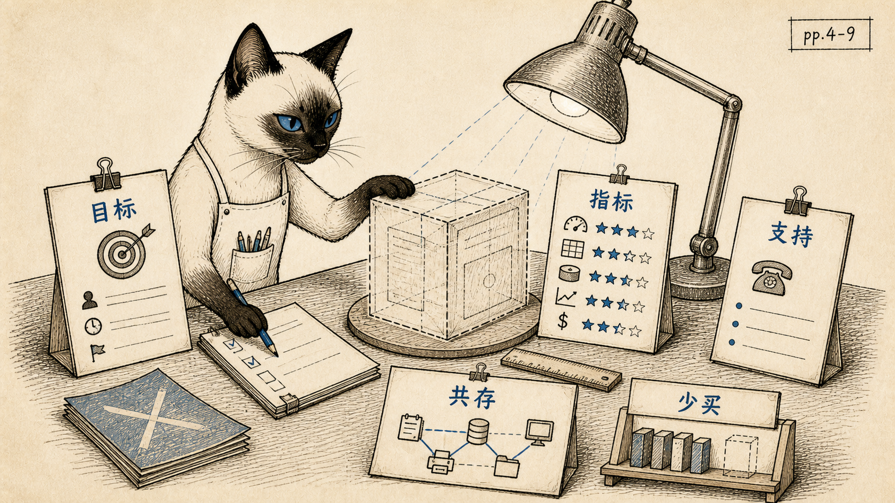

- range: pp.4-9
- anchor: 买软件之前，先把目标、指标、支持和共存关系说清楚。
- reader: 这章把购买软件变成一场评估练习：目标能否被观察，指标能否被验证，工具能否和现有流程一起工作。

## 03. Computer Magazines

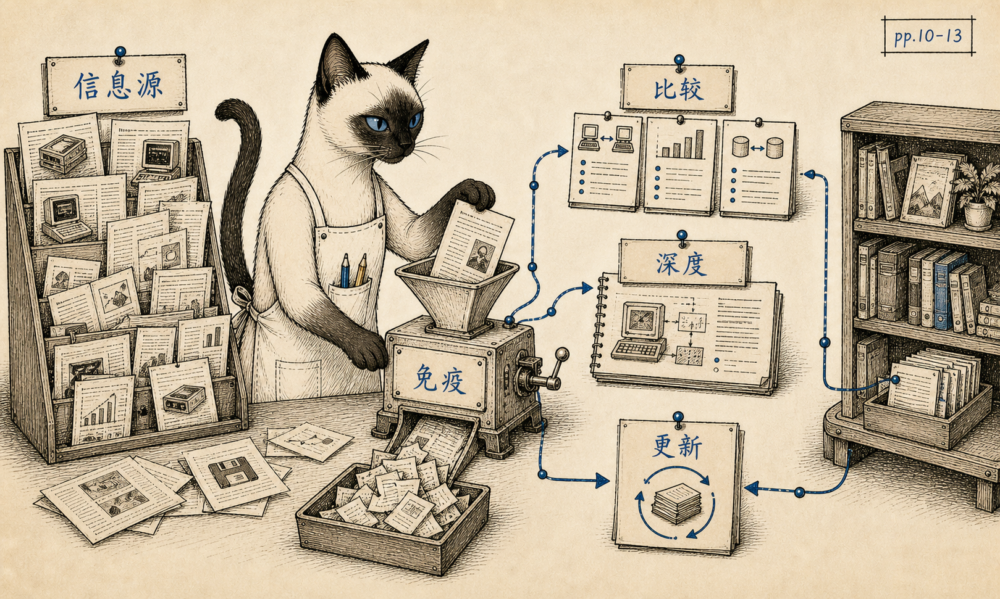

- range: pp.10-13
- anchor: 软件世界变化太快，读者需要信息生态，也需要免疫系统。
- reader: 软件世界变化太快，读者需要不止一个信息源；真正重要的是在评论、比较和技术深度之间建立辨别力。

## 04. Hardware

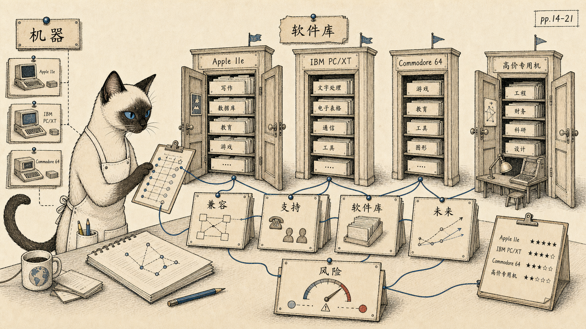

- range: pp.14-21
- anchor: 买硬件不是买参数，而是在选择能进入哪个软件世界。
- reader: 这章提醒读者：每台机器背后都有一座可进入的软件库，也有一批从此被排除在外的工具。

## 05. Buying

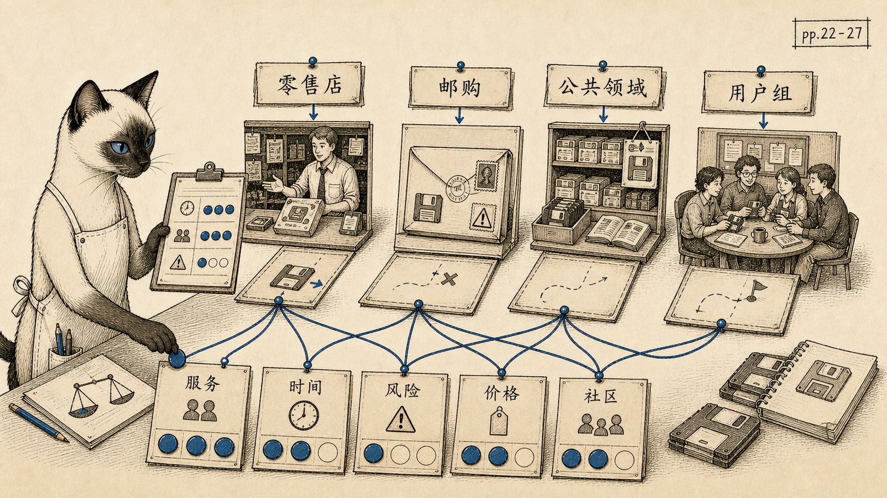

- range: pp.22-27
- anchor: 买软件也是管理时间、风险、服务和社群的渠道选择。
- reader: 零售店、邮购、用户组和公共领域软件并不是单纯价格差异，而是时间、服务、兼容性和风险的不同组合。

## 06. Playing

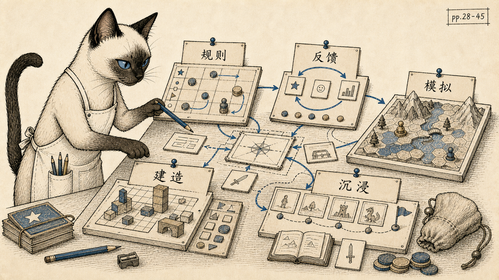

- range: pp.28-45
- anchor: 游戏不是低级用途，而是大众理解互动、规则、反馈和模拟的实验室。
- reader: Whole Earth 把游戏放在前面，因为游戏最早让普通人感到计算机可以回应、模拟、设定规则并允许改造。

## 07. Writing

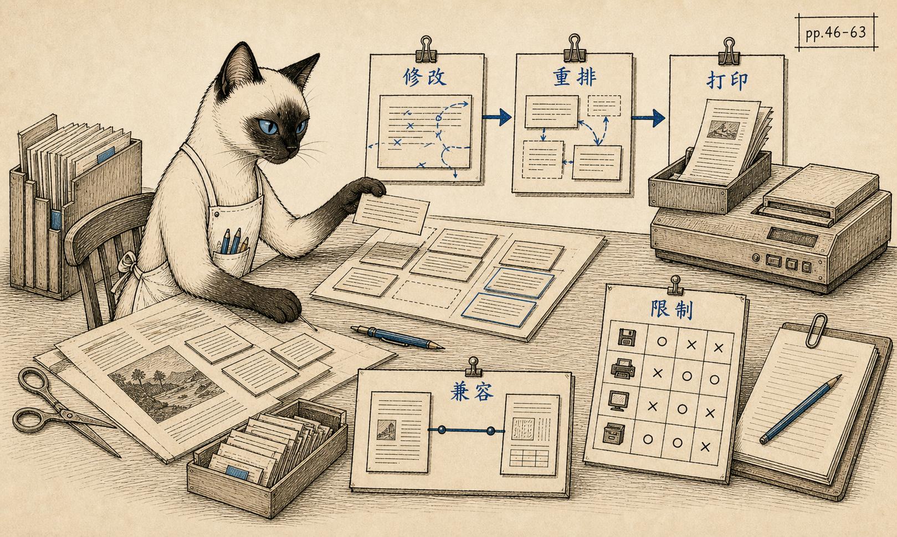

- range: pp.46-63
- anchor: 文字处理改变的不只是打字速度，而是修改、重排和思考文本的方式。
- reader: 这里的重点不是打字更快，而是写作者能否轻松修改、重排、打印、传递，并在限制中保持自己的工作节奏。

## 08. Analyzing

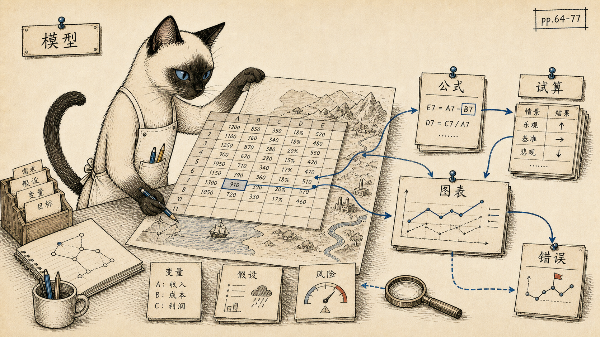

- range: pp.64-77
- anchor: 电子表格让非程序员把数字关系变成可操作的未来模型。
- reader: 电子表格把数字关系变成可操作模型，让非程序员也能试算未来；同时，模型错误也会成为新的风险。

## 09. Organizing

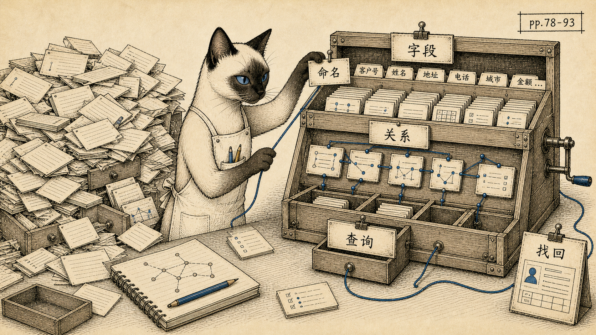

- range: pp.78-93
- anchor: 数据库不是存东西的箱子，而是设计未来找回方式的工具。
- reader: 数据库的意义不只是保存资料，而是让人通过命名、分类、字段和关系设计未来的找回方式。

## 10. Accounting

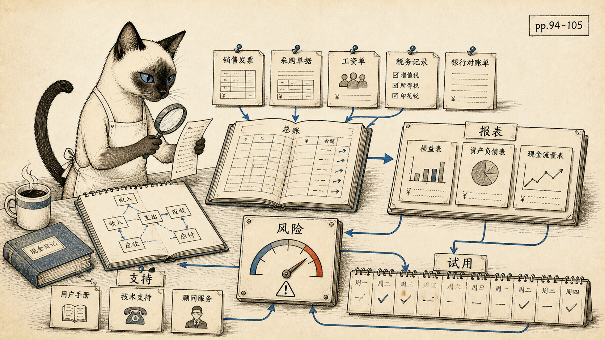

- range: pp.94-105
- anchor: 会计软件不是让账本好看，而是让小企业及时看见现金流和风险。
- reader: 会计软件进入企业核心流程之后，电脑不再只是玩具或写作辅助，而是现金流、报表和风险判断的一部分。

## 11. Managing

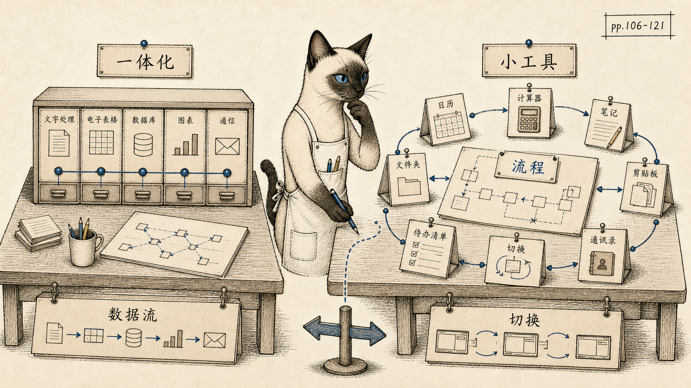

- range: pp.106-121
- anchor: 现代办公软件的两条路线早已出现：一体化平台，或围绕工作流的小工具生态。
- reader: 这章已经能看到现代办公软件的两条路线：把所有功能放进一个环境，或用小工具补强具体工作流。

## 12. Drawing

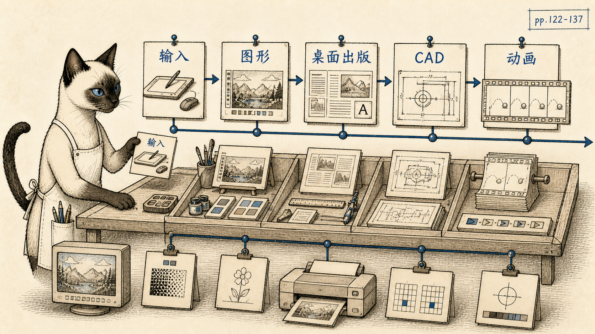

- range: pp.122-137
- anchor: 图形软件把儿童涂鸦、桌面出版、商业图表、CAD 和动画放进同一条视觉生产谱系。
- reader: 图形软件把屏幕、打印机、输入设备和创作工具连在一起，让视觉生产开始从专业设备走向个人电脑。

## 13. Telecommunicating

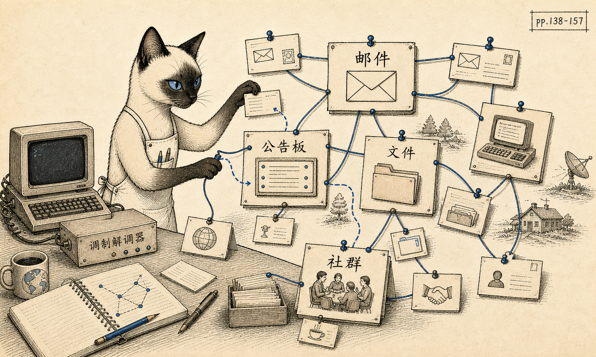

- range: pp.138-157
- anchor: 1985 年的电脑通信不是外设功能，而是个人计算机的社会未来。
- reader: 这一章几乎是互联网前夜的社会学笔记：电子邮件、公告板、文件传输、在线服务和远程协作已经露出轮廓。

## 14. Programming

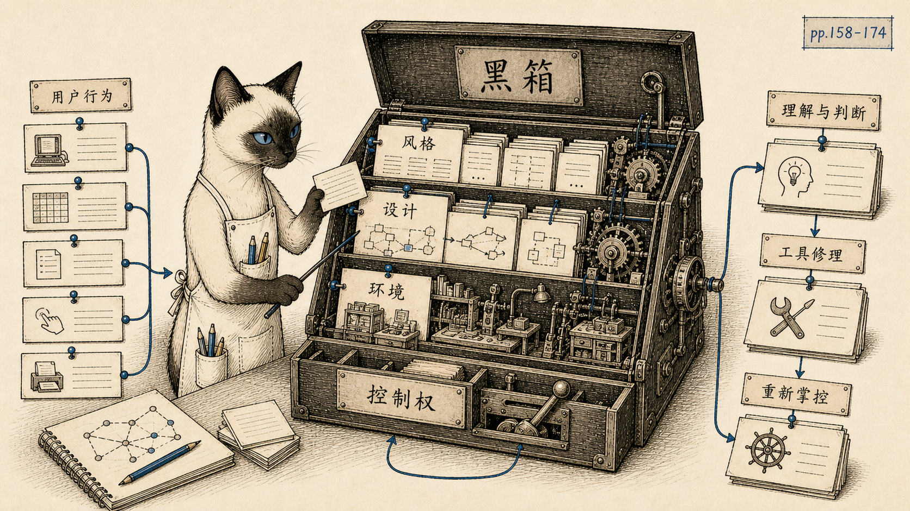

- range: pp.158-174
- anchor: 编程素养不是职业专利，而是理解软件黑箱、判断工具、重新获得控制权的方法。
- reader: Programming 在这里不是职业训练，而是一种软件素养：理解黑箱、判断工具、设计流程，并在必要时修补环境。

## 15. Learning

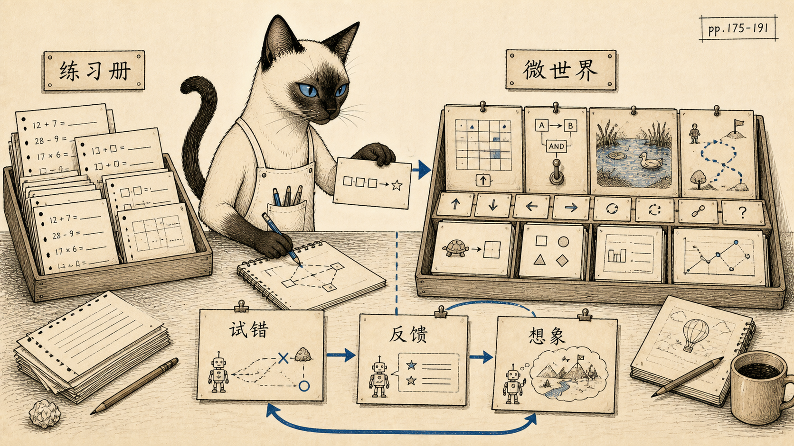

- range: pp.175-191
- anchor: 好的学习软件不是电子练习册，而是可试错、可操纵、可想象的微世界。
- reader: Whole Earth 反对把电脑变成电子练习册；它期待的是能回应、能模拟、能让错误变成探索的学习环境。

## 16. Etc.

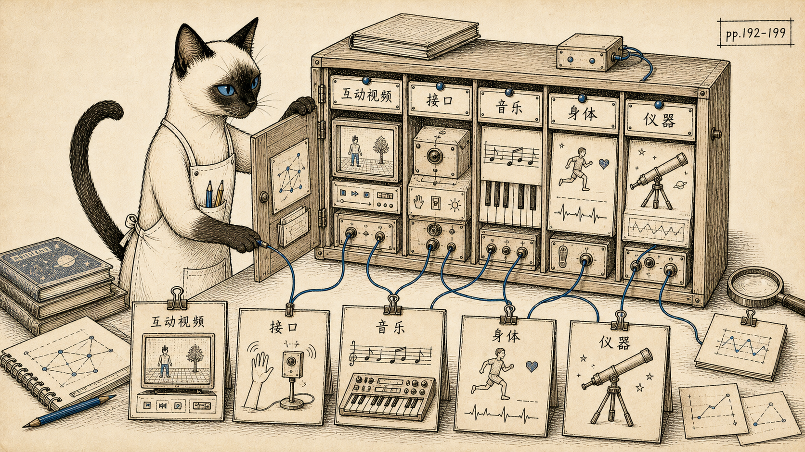

- range: pp.192-199
- anchor: 软件不只属于办公室和学校，它开始连接影像、身体、音乐、仪器和物理世界。
- reader: 这些杂项显示软件正在越过办公室和学校，进入影像、音乐、身体、家庭设备和物理世界。

## 17. Indexes / Update

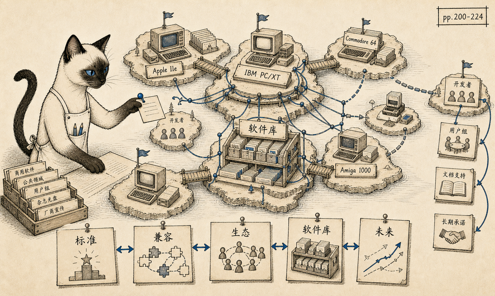

- range: pp.200-224
- anchor: 标准不是单纯由最好技术决定，而是由软件生态、兼容性和开发者承诺滚出来。
- reader: 最后的行业更新指出一个持续至今的问题：标准往往不是由最好技术决定，而是由生态、兼容性和承诺滚出来。

## 附录：页级补充

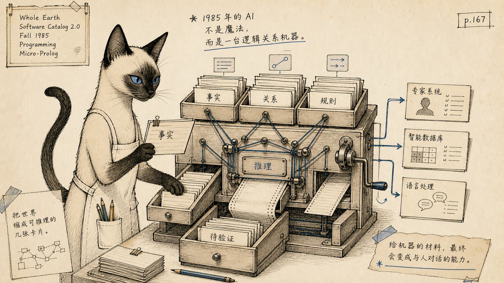

- page: Programming / Micro-Prolog, p.167
- anchor: 1985 年的 AI 不是魔法，而是一台逻辑关系机器。
- reader: 这页把 1985 年的 AI 想象放在逻辑、关系、专家系统、数据库和语言处理的语境里，兴奋但不神化。
